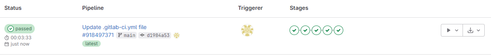
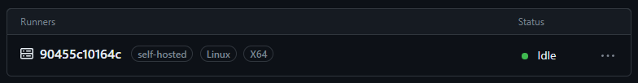

SPW4 - Exercise 3
=================

Name: Alexander Schmidt

Effort in hours: 10

## 1. 2048 Web Application and CI/CD Pipeline

### Task 1.a

Tasks were fulfilled in lesson session.

Screenshot after mvn compile:

Screenshot after mvn test:

Screenshot after mvn package:

Screenshot of created .war File:

### Task 1.b

Tasks were fulfilled in lesson session. 

Screenshot of GitLab Runners:

Screenshot of GitLab Pipeline:

Screenshot of GitLab Pipeline after Deployment:

Screenshot of detailed GitLab Pipeline:

Screenshot of detailed GitLab Pipeline after executing deploy_stop:

### Task 1.c

Screenshot of GitHub Runner:

